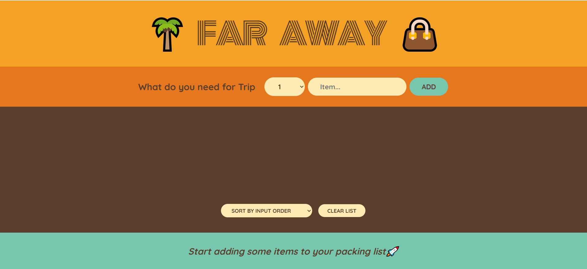

# 🌴 Far Away - Trip Packing List App

**Far Away** is a fun and intuitive React web application that helps users plan for their trips by managing a personalized packing list. With a tropical vibe and a colorful interface, users can add, sort, and clear items to ensure nothing is left behind before heading out!

## 🖼️ Preview



## 🚀 Features

- ✅ Add items with quantity and description
- 🔄 Sort items by input order, name, or packed status
- ❌ Clear the entire list with one click
- ✏️ User-friendly form to input item details
- 🎨 Stylish and colorful UI with vacation-themed icons

## 🛠️ Tech Stack

- **React** (with hooks like `useState`)
- **HTML/CSS**
- Optional: LocalStorage (if data persistence is implemented)

## 📦 Installation

```bash
git clone https://github.com/your-username/far-away-trip-app.git
cd far-away-trip-app
npm install
npm start
```

The app will run at: `http://localhost:3000`

## ✍️ How to Use

1. Enter the quantity and name of an item you want to pack.
2. Click `ADD` to include the item in your list.
3. Use the dropdown to sort items.
4. Use `CLEAR LIST` to start over.

## 🖌️ Customization

- You can enhance the theme or replace icons (like the palm tree or bag) in the header.
- Modify the CSS to match your trip or destination theme.

## 📁 Folder Structure

```
src/
│
├── components/
│   ├── Header.js
│   ├── PackingList.js
│   ├── AddItemForm.js
│   ├── Item.js
│
├── App.js
├── index.js
├── styles.css
```

## 🤝 Contributing

Pull requests are welcome! For major changes, please open an issue first to discuss what you’d like to change.

## 📜 License

[MIT](LICENSE)

---

**Happy Packing! 🚀🌍**
